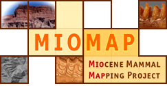
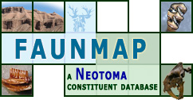
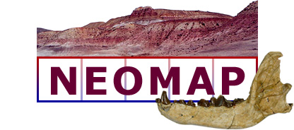

# MIOMAP, FAUNMAP, and NEOMAP legacy repository

This site contains a downloadable file for all of MIOMAP and FAUNMAP (see all_miomap.txt).  These two projects together compose the NEOMAP project.  
A berkeleymapper link with all data is below:

https://berkeleymapper.berkeley.edu/?ViewResults=tab&tabfile=https://raw.githubusercontent.com/BNHM/miomap/main/all_miomap.txt&configfile=https://raw.githubusercontent.com/BNHM/miomap/main/miomap_config.xml

As of Januuary 24, 2023 we forwarded https://miomap.berkeley.edu/ to https://ucmp.berkeley.edu/miomap/
